# Multi-Armed Bandit Algorithms — Chapter 2 Reproduction & Extensions

This project implements and evaluates a comprehensive set of **multi-armed bandit algorithms**, reproducing the core ideas from Chapter 2 of *Reinforcement Learning: An Introduction* by Richard S. Sutton and Andrew G. Barto, while also including several **modern extensions used in bandit research**.

The goal of the project is to study the **exploration–exploitation trade-off** through simulation experiments across different environments, estimators, and policies.

---

# Project Goals

This project aims to:

- Reproduce the **key algorithms from Chapter 2** of Sutton & Barto
- Compare multiple **exploration strategies**
- Evaluate **different action-value estimation methods**
- Analyse performance under **stationary and nonstationary environments**
- Study **parameter sensitivity**
- Extend the analysis with **modern bandit techniques** such as Thompson sampling and regret analysis

---

# Bandit Framework Taxonomy

The multi-armed bandit problem can be decomposed into four core components:

1. **Environment** – how rewards are generated  
2. **Estimator** – how action values are estimated  
3. **Policy** – how actions are selected  
4. **Metric** – how algorithm performance is evaluated  

```mermaid
graph TD

A[Multi-Armed Bandit Problem]

A --> B[Environment]
B --> B1[Stationary Bandit]
B --> B2[Nonstationary Bandit]
B --> B3[Contextual Bandit]

A --> C[Action Value Estimation]
C --> C1[Sample Average]
C --> C2[Constant Step Size]
C --> C3[Unbiased Constant Alpha]
C --> C4[Sliding Window]

A --> D[Policies / Action Selection]
D --> D1[Greedy]
D --> D2[Epsilon Greedy]
D --> D3[Optimistic Initial Values]
D --> D4[Upper Confidence Bound]
D --> D5[Softmax / Boltzmann]
D --> D6[Gradient Bandit]
D --> D7[Thompson Sampling]

A --> E[Experiments]
E --> E1[Epsilon Greedy Comparison]
E --> E2[Algorithm Comparison]
E --> E3[Parameter Study]
E --> E4[Nonstationary Tracking]
E --> E5[Contextual Bandit Experiment]

A --> F[Evaluation Metrics]
F --> F1[Average Reward]
F --> F2[Optimal Action Percentage]
F --> F3[Cumulative Regret]
```



---

# Environment Types

## Stationary Bandit

The true action values remain constant over time.

```
q*(a) = constant
```

---

## Nonstationary Bandit

The reward distribution changes over time via a random walk.

```
q*(a)_{t+1} = q*(a)_t + noise
```

---

## Contextual Bandit

Rewards depend on the current state or context.

```
Q(s,a)
```

The optimal action varies depending on the environment state.

---

# Action-Value Estimators

These determine how the agent updates its estimate of expected reward.

## Sample-Average Estimator

```
Q ← Q + (1/N)(R − Q)
```

Uses the average of all observed rewards.

---

## Constant Step-Size Estimator

```
Q ← Q + α(R − Q)
```

Places more weight on recent rewards.

---

## Unbiased Constant Step-Size Trick

Removes initialization bias present in constant step-size updates.

---

## Sliding Window Estimator

```
Q(a) = average of last W rewards
```

Uses only the most recent observations, useful in nonstationary environments.

---

# Action Selection Policies

These determine how the agent selects actions.

## Greedy

Always chooses the action with the highest estimated value.

---

## ε-Greedy

Chooses the best action most of the time but explores randomly with probability ε.

---

## Optimistic Initial Values

Encourages exploration by initializing action values with high estimates.

---

## Upper Confidence Bound (UCB)

Balances exploration and exploitation using confidence bounds.

```
Q(a) + c * sqrt( ln(t) / N(a) )
```

---

## Softmax / Boltzmann Policy

Selects actions probabilistically based on preference scores.

```
π(a) = exp(H(a)) / Σ exp(H(b))
```

---

## Gradient Bandit

Updates action preferences directly using stochastic gradient ascent.

---

## Thompson Sampling

A Bayesian approach that samples reward estimates from posterior distributions.

---

# Experiments

The project evaluates algorithms using several experimental setups:

- ε-Greedy exploration comparison
- Algorithm performance comparison
- Parameter sensitivity analysis
- Nonstationary reward tracking
- Contextual bandit learning experiments

---

# Evaluation Metrics

## Average Reward

Mean reward obtained over time.

---

## Optimal Action Percentage

The fraction of times the optimal action is selected.

---

## Cumulative Regret

```
Regret(T) = Σ (q* − q_A_t)
```

Measures the total loss incurred by not always choosing the optimal action.

---

# Chapter 2 Coverage

This project reproduces the following ideas from Chapter 2 of Sutton & Barto:

- Greedy action selection
- ε-Greedy exploration
- Optimistic initial values
- Upper Confidence Bound (UCB)
- Gradient bandit algorithms
- Sample-average estimation
- Constant step-size estimation
- Nonstationary bandit tracking
- Contextual bandits (associative search)

---

# Extensions Beyond Chapter 2

To broaden the analysis, the project also includes:

- Sliding window estimators
- Thompson sampling
- Regret-based evaluation

These extensions are commonly used in modern bandit research.

---

# Installation

Clone the repository:

```bash
git clone https://github.com/yourusername/bandit-algorithms.git
cd bandit-algorithms
```

Install dependencies:

```bash
pip install -r requirements.txt
```

---

# Running Experiments

Run the main experiment script:

```bash
python main.py
```

This will generate all figures used in the analysis.

---

# Example Results

Typical outputs include:

- Average reward learning curves
- Optimal action percentage
- Parameter sensitivity plots
- Nonstationary tracking performance
- Contextual bandit learning curves

---

# References

Sutton, R. S., & Barto, A. G. (2018).  
*Reinforcement Learning: An Introduction (2nd ed.)*. MIT Press.

---

# License

MIT License
